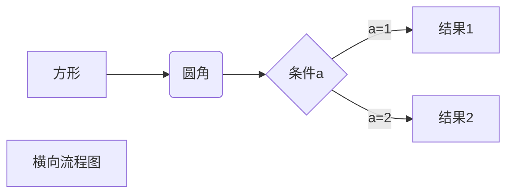
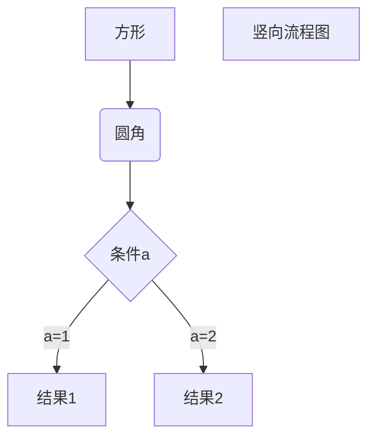
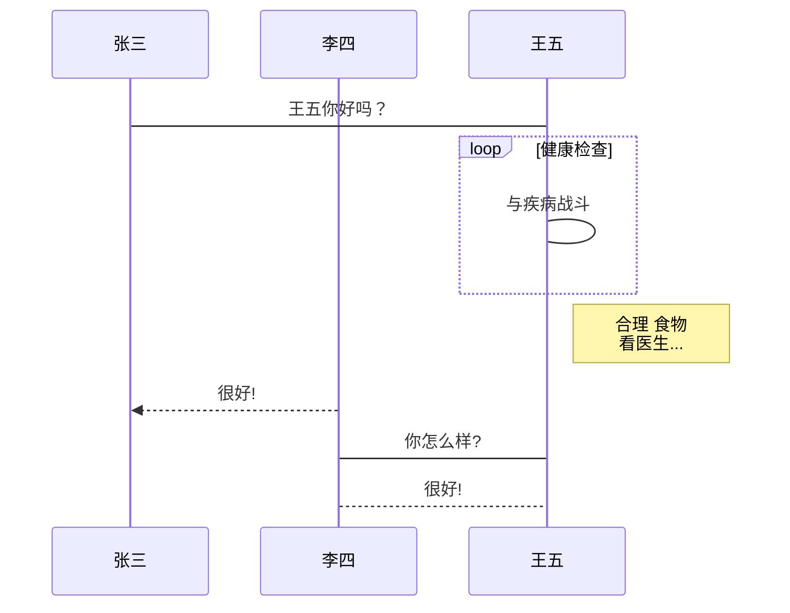
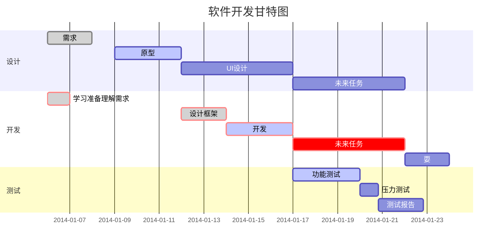

---
layout: post
title: 我的第一个md文件
date:  2020-02-29 12:16:00 +0900
description: 我的第一个md文件
img: post-2.jpg # Add image post (optional)
tags: [Jekyll,GitHub]
author: # Add name author (optional)
jekyll: true
---
{{site.label1}} <a href="https://qinyua.github.io/" target="\_blank">James Qin</a> {{site.label2}}

[TOC]


## 看看是否好用

这次好用了吧

## 还不好用吗？

搞了半天是所有的格式都需要通过快捷键和右键来选择啊，让我自己输入了半天也不行。

## 加入一个图片看看

接下来加个图片看看


## 这次加入一个列表

这次我再加入一个列表看看。

+ 这是一个列表

+ 这是一个列表项1

+ 这是一个列表项2

  - 这又是一个列表项

  - 这是一个分项

    1. 这是分项里的有序项
    2. 看来这个软件还是挺好用的

    + 这样也可以啊

  - 这有回到这一级目录

+ 通过<kbd>shift</kbd>+<kbd>tab</kbd>就可以返回上一个层级的目录。

##  初步总结
初次用typora软件有点不习惯，一直想按照记事本的习惯往编辑器里写内容。然后是按照makedown语法进行进行输入的。然后发现各种功能都无法实现啊。搞的我有点怀疑人生了。后来慢慢的才知道，原来用这个软件不是自己输入\#或者\#\#来标识是不是一个标题的。而是需要用软件自带的选项来选择这是一个标题还是一个图片来使用。
这下写完再用记事本打开发现--哦语法还是没有问题的。跟刚刚学习的是一样的。

*但是不能忘记加空格，不然是不执行的，*

**再次使用发现typora其实也可以直接按照makedown的语法直接如入的。但是就是因为忘记加入标识符后的换行符导致自己的输入一直是不成功的。**

## 再插入一个有序列表

1. qqqqq
2. 123123
3. aaaasd


## 插入一个代码块

 `print("hello world")`

##  插入链接看看

[这是一个链接]( http://qinyua.github.io	"这个是链接提示")

## 再插入一个引用

<!--引用一个啥 > 引用一个啥呢-->

> 怎么引用啊
>
> ​	

## 再插入一个表格

| 第一列 | 第二列 | 第三列 | 第四列 |
| :----- | :----: | -----: | ------ |
| 1      |   2    |      3 | 7      |
| 4      |   5    |      6 | 8      |


## 再插入一个标注

[^这是啥]: 个是里面标注的内容啊
[^这是啥]: 这里是标注的具体内容

## 再测试一下HTML的元素

<kbd>ctrl</kbd>+<kbd>alt</kbd>+<kbd>A</kbd>就相当于是一个截屏按键

<br/>

## 插入几种字体样式

*这是斜体*

**这个是粗体**

~~这个是删除样式字体~~

__这个是什么字体__

## 还可以插入选择框

- [ ] 这个是1
- [ ] 这个是2
- [ ] 这个是3

+++

##  总结

总的来说这个makedown这种轻量级标记语言还是挺好的。我学习的目的主要是为了导入博客使用。

2020-02-28

1、横向流程图源码格式：


2、竖向流程图源码格式：


3、标准流程图源码格式：

```flow
st=>start: 开始框
op=>operation: 处理框
cond=>condition: 判断框(是或否?)
sub1=>subroutine: 子流程
io=>inputoutput: 输入输出框
e=>end: 结束框
st->op->cond
cond(yes)->io->e
cond(no)->sub1(right)->op
```
4、标准流程图源码格式（横向）：

```flow
st=>start: 开始框
op=>operation: 处理框
cond=>condition: 判断框(是或否?)
sub1=>subroutine: 子流程
io=>inputoutput: 输入输出框
e=>end: 结束框
st(right)->op(right)->cond
cond(yes)->io(bottom)->e
cond(no)->sub1(right)->op
```
5、UML时序图源码样例：

```sequence
对象A->对象B: 对象B你好吗?（请求）
Note right of 对象B: 对象B的描述
Note left of 对象A: 对象A的描述(提示)
对象B-->对象A: 我很好(响应)
对象A->对象B: 你真的好吗？
```
6、UML时序图源码复杂样例：

```sequence
Title: 标题：复杂使用
对象A->对象B: 对象B你好吗?（请求）
Note right of 对象B: 对象B的描述
Note left of 对象A: 对象A的描述(提示)
对象B-->对象A: 我很好(响应)
对象B->小三: 你好吗
小三-->>对象A: 对象B找我了
对象A->对象B: 你真的好吗？
Note over 小三,对象B: 我们是朋友
participant C
Note right of C: 没人陪我玩
```
7、UML标准时序图样例：


8、甘特图样例：




